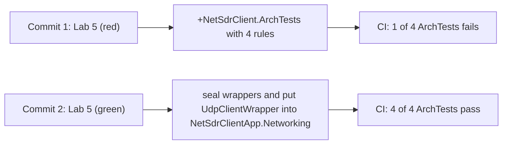

# Лабораторна робота 5. Архітектурні правила (NetArchTest)

**Дисципліна**: Реінжиніринг програмного забезпечення  
**Студент**: Биков Нікіта Вячеславович  
**Група**: ПЗС-1  
**Гілка**: `lab-05-arch-rules`  
**Pull Request**: створюється з `nik-bykoff:lab-05-arch-rules` у `lenagrin/ReengineeringCourse:master`

## Мета

Перевести «гарну архітектурну поведінку» з рівня домовленостей у рівень виконуваних тестів: додати незалежний проєкт `NetSdrClient.ArchTests` із бібліотекою [`NetArchTest.Rules`](https://github.com/BenMorris/NetArchTest), кодувати правила залежностей як NUnit-тести і таким чином інтегрувати їх у Quality Gate.

## Хід виконання

PR умисно складається з двох комітів — щоб у git-історії було видно артефакт «red CI -> green CI», який і є метою лаби.



### Архітектурні правила, що кодуються у [`NetSdrClient.ArchTests/ArchitectureTests.cs`](../../NetSdrClient.ArchTests/ArchitectureTests.cs)

1. `Messages_ShouldNotDependOn_Networking` — тип з `NetSdrClientApp.Messages` не повинен використовувати жоден тип з `NetSdrClientApp.Networking`. Гарантує, що бізнес-домен (формат повідомлень) не «зливається» з транспортом.
2. `Networking_ShouldNotDependOn_Messages` — симетрично: транспорт не «втягує» домен. Це фактично проголошує одностороннє підпорядкування у бік верхнього рівня (`NetSdrClient` оркеструє обидва).
3. `Interfaces_InNetworking_ShouldStartWithI` — конвенція іменування `I*` для інтерфейсів. Захищає від дрейфу стилю.
4. `NetworkingWrappers_ShouldBeSealed` — типи з суфіксом `Wrapper` мають бути `sealed`. Чітко комунікує, що такі класи — кінцева імплементація транспорту, не призначені для наслідування.

### Червоний прогін (commit 1)

При запуску `dotnet test NetSdrClient.ArchTests` правило 4 вкаже на `NetSdrClientApp.Networking.TcpClientWrapper`:

```text
Failed NetworkingWrappers_ShouldBeSealed
   Wrapper classes in Networking namespace should be sealed to prevent unintended subclassing.
   Failing types: NetSdrClientApp.Networking.TcpClientWrapper
```

`UdpClientWrapper` у цей момент ще не сканується, бо знаходиться у глобальному namespace (це окремий smell, який також буде виправлено).

### Зелений прогін (commit 2)

У комiті `Lab 5 (green)` зроблено:

- [`TcpClientWrapper`](../../NetSdrClientApp/Networking/TcpClientWrapper.cs) — позначено як `sealed`.
- [`UdpClientWrapper`](../../NetSdrClientApp/Networking/UdpClientWrapper.cs) — перенесено у namespace `NetSdrClientApp.Networking` і також позначено `sealed`.
- [`IUdpClient`](../../NetSdrClientApp/Networking/IUdpClient.cs) — також перенесено у namespace `NetSdrClientApp.Networking` для консистентності з `ITcpClient`.

Після фіксу прогін зелений: `Failed: 0, Passed: 4`. Існуючі 18 тестів проєкту `NetSdrClientAppTests` залишаються 18/18 зеленими, бо `using NetSdrClientApp.Networking;` у `Program.cs` тепер коректно резолвить обидва типи.

## Зміни у коді та конфігурації

| Файл | Зміна |
|------|-------|
| [`NetSdrClient.sln`](../../NetSdrClient.sln) | + проєкт `NetSdrClient.ArchTests` |
| [`NetSdrClient.ArchTests/NetSdrClient.ArchTests.csproj`](../../NetSdrClient.ArchTests/NetSdrClient.ArchTests.csproj) | новий проєкт з пакетом `NetArchTest.Rules` 1.3.2 |
| [`NetSdrClient.ArchTests/ArchitectureTests.cs`](../../NetSdrClient.ArchTests/ArchitectureTests.cs) | 4 архітектурні правила |
| [`NetSdrClientApp/Networking/TcpClientWrapper.cs`](../../NetSdrClientApp/Networking/TcpClientWrapper.cs) | `public class` -> `public sealed class` |
| [`NetSdrClientApp/Networking/UdpClientWrapper.cs`](../../NetSdrClientApp/Networking/UdpClientWrapper.cs) | додано `namespace NetSdrClientApp.Networking`, тип `sealed` |
| [`NetSdrClientApp/Networking/IUdpClient.cs`](../../NetSdrClientApp/Networking/IUdpClient.cs) | додано `namespace NetSdrClientApp.Networking` |

## Як перевірити

```bash
# Прогін лише архітектурних тестів
dotnet test NetSdrClient.ArchTests/NetSdrClient.ArchTests.csproj -c Release

# Усе разом
dotnet test NetSdrClient.sln -c Release
```

Очікуваний вивід після обох комітів:

```text
Passed!  - Failed: 0, Passed: 18, ...   - NetSdrClientAppTests.dll
Passed!  - Failed: 0, Passed:  4, ...   - NetSdrClient.ArchTests.dll
```

Якщо хтось у майбутньому випадково:
- додасть `using NetSdrClientApp.Networking;` у файл усередині `Messages` -> правило 1 заблокує;
- зробить новий wrapper-клас не `sealed` -> правило 4 заблокує;
- назве інтерфейс без `I` префіксу -> правило 3 заблокує.

## Метрики до/після

| Метрика | До commit 1 | Після commit 1 (red) | Після commit 2 (green) |
|---------|-------------|----------------------|------------------------|
| Архітектурних тестів усього | 0 | 4 | 4 |
| Failed | n/a | 1 | 0 |
| Wrapper-класи `sealed` | 0 з 2 | 0 з 2 | 2 з 2 |
| Типи `Networking` поза namespace | 2 (`UdpClientWrapper`, `IUdpClient`) | 2 | 0 |

## Висновки

NetArchTest перетворює архітектурні домовленості на тести: вони запускаються разом із юніт-тестами і блокують злиття через CI/Quality Gate. Демо-коміт із червоним станом фіксує, що тести реально ловлять порушення, а не тільки красиво виглядають на папері.

## Посилання

- [BenMorris/NetArchTest — README](https://github.com/BenMorris/NetArchTest)
- [Pluralsight — Architecture testing in .NET](https://www.pluralsight.com/courses/architecture-testing-applications-net)

## Скріни

```text
[ScreenAction2] Actions run для commit 1 — червоний (1 архтест fail)
[ScreenAction3] Actions run для commit 2 — зелений (4/4 pass)
[ScreenSonar10] Sonar Activity — чотири нові тести у звіті
```
